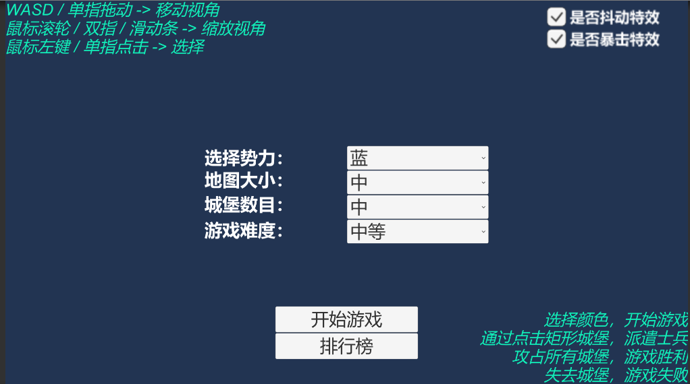
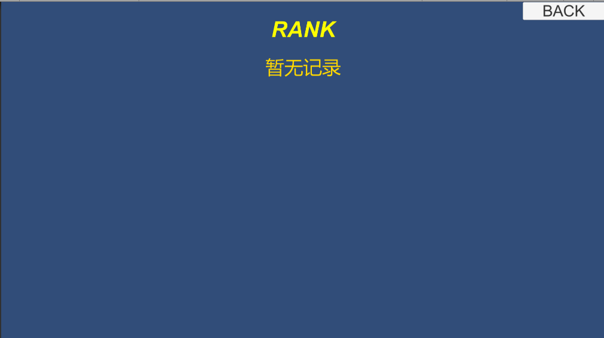
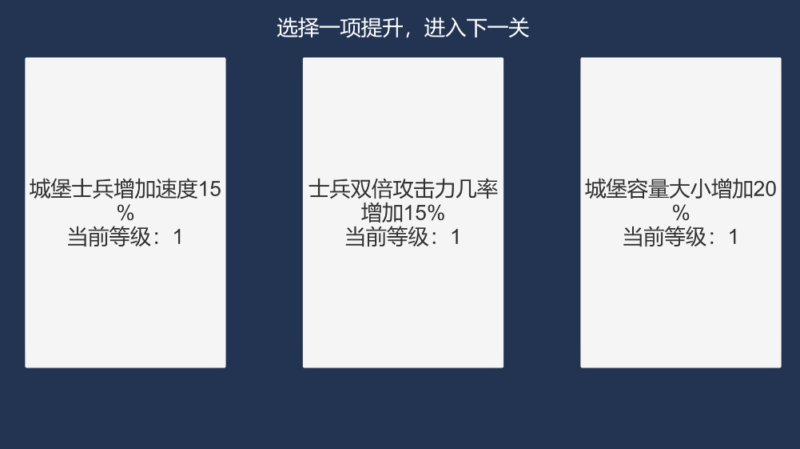
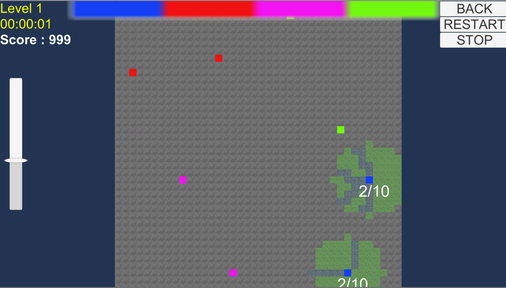

apk download : <https://www.taptap.com/app/202356>

Video Demo : <https://www.bilibili.com/video/BV1vK4y177U6/>

# WaterFlow

最新2.0版更名为`Water Flow`。游戏的核心玩法未变，游戏的迷雾由之前的GameObject遮挡改为点光源光照。加入自定义地图功能。

具体操作演示： <https://www.bilibili.com/video/BV1vK4y177U6/>

## 关键技术分享

* 音效编辑

游戏的音效使用 Audacity 进行编辑，非常简洁好用的软件，可以使用它录制系统声音或者麦克风声音，然后进行一些诸如截取片段、改变音量等操作。

* 新版雾效果分享

为每个水滴（士兵）预制体添加了点光源，每个水泡（城堡）预制体也添加了点光源，然后去除全局方向光即非常方便的实现了雾效果。

同时为了表示敌方水泡是否被查看（被查看的话显示水滴数等），需要定义一个二维 float 矩阵，每次 Update 将矩阵的值减小。当减小到一定值时，表示无法查看。而在我方水泡、水滴周围的矩阵的值将设定为一个初始值表示可以查看。

* 水波纹设计

为符合整体主题设计了水波纹，思想为在片段着色器里面对纹理坐标采样时的进行偏移。百度水波纹有这方面的实现。也可以参考我github里面的实现。

* 自定义地图编辑

实现要实现地图数据的保存，采用了SQLite保存，为保证保存速度，采用批量插入。
需要注意的是在Android平台下，SQLite的批量插入格式为：

```sql
insert into 表名(列名1,列名2)    
select  值1,值2
union all 
select 值1,值2
```

区别于

```sql
insert into 表名(列名1,列名2)    
values  (值1,值2),
        (值1,值2)
```

并且一次最多500条数据。

---

# ScratchLottery

一款由Unity开发的RTS类型的游戏，游戏的核心玩法为派遣士兵攻占城堡获取胜利。（该玩法思路来源于作者很早之前玩过的一款游戏，名字已经忘记，感谢朋友的试玩，提出了很多好的修改意见）

游戏开发至1.0版本耗时一周左右，开发时的指导思想即为轻美工、轻剧情、强玩法、强操作。游戏英文名暂定为ScratchLottery，因为添加战斗迷雾后，配合上像素风界面，战斗时酷似刮彩票。\\^o^/

## 游戏界面

* 开始界面



* 排行榜界面



* 过关能力选择界面



* 主战斗界面



* 失败界面、成功界面（会总结玩家部分战斗数据）


## 游戏演示


---

技术分割线，下面的讨论涉及游戏本身所使用的技术。

---

## 游戏目录

* Prefabs文件夹：

包含道路（go）、城堡（house）、不可移动道路（stop）、士兵（Sphere）、雾（fog）、顶部势力图（cube）预制体。

* Resources文件夹：

包含道路（go）、不可移动道路（stop）、雾（fog）、顶部势力图（cube）纹理。

* Materials文件夹：

包含道路（go）、不可移动道路（stop）、雾（fog）、城堡（New Material 1）、闪烁城堡（New Material 3）材质。

* Shaders文件夹：

包含城堡（NewUnlitShader）、闪烁城堡（SelectShader）材质。

* Scenes文件夹：

包含六大场景

* Scripts文件夹：

包含六大场景文件夹，里面存放场景对应的C# Script。

## 关键技术分享

作者刚学Unity，很多效果都是通过直觉（做过GUI程序、OpenGL程序）做出来的，有更好的实现方法欢迎批评指正。游戏虽然表现为2D，但是项目创建时为Unity 3D。

* 像素风雾效果

首先想到的是在shader里面定义一个Color和一个int变量，
在C#脚本里面初始化一个对应图的二维bool数组表示当前位置是否有雾效果，
在Update里面遍历每一个点，如果为false表示有雾，设置Shader的int变量为1，让Shader的输出颜色为指定的Color（雾颜色），如果为true表示没有雾，设置Shader的int变量为0，让Shader的输出颜色为原本的纹理颜色。

实现时发现比较繁琐，于是采用了第二种方法，用GameObject的SetActive来控制是否开启雾。这种方法简单统一，且便于修改。
还是在C#脚本里面初始化一个对应图的二维bool数组表示当前位置是否有雾效果，在Update里面遍历每一个点，如果为false表示有雾，设置雾的预制体SetActive为true。反之false。

* 顶部势力图

首先用unity提供的UI控件很难自定义出想要的效果。（应该不能魔改滚动条吧）
而如果直接是在游戏场景中则会发生位置的变化。于是用另一个摄像头在距离很远处，将结果渲染至纹理。
再在主摄像头的UI里面，定义RAW IMAGE显示纹理。

势力图的每个Cube表示一个城堡，通过计算当前城堡数，设置相应的scale。

* 随机技能

过关后会有随机三个技能提示选项（我的思路来源于崩坏3）。

在一堆技能中做到随机三个，使用洗牌算法在O(N)时间复杂度 O(1)空间复杂度下随机打乱。然后选取前三个就行。

* 随机地图生成

城堡随机的生成，首先是固定4个势力分布在4个角，保证每个角城堡数相同，for循环城堡数 %4 就行。
生成时，参考八皇后放置算法，设置城堡四周为不可放置，放置城堡过于密集。

因为考虑到地图太小，后放置的城堡放不下，设定一个运行尝试次数，达到次数后，重新加载场景，重新生成。

道路随机的生成，随机选取两个城堡，使用绘制直线方法绘制（用的斜率绘制法，布雷森汉姆直线算法更好），
绘制时为保证不出现道路割裂感，在位置偏移时，多绘制一个转角。

为保证生成的地图质量，检测生成的直线是否存在交叉，存在交叉时，该条道路放弃生成。

在生成后，进行检测，从任一城堡出发，通过DFS遍历，若遍历后城堡数不为总城堡数，则表明存在孤立的城堡，重新加载场景，重新生成。
